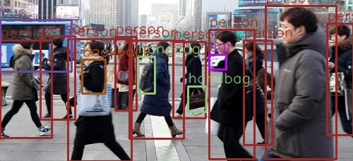

## Download test data
- /opt/homebrew/bin/wget -O traffic.jpg "https://cdn.pixabay.com/photo/2013/07/05/01/08/traffic-143391_960_720.jpg"
- /opt/homebrew/bin/wget -O vehicle.jpg https://hips.hearstapps.com/hmg-prod.s3.amazonaws.com/images/10best-cars-group-cropped-1542126037.jpg

## Reference
- [Faster R-CNN](https://debuggercafe.com/object-detection-using-pytorch-faster-rcnn-resnet50-fpn-v2/)

> python3 fasterrcnn.py -m v3 -i data/work.jpg

